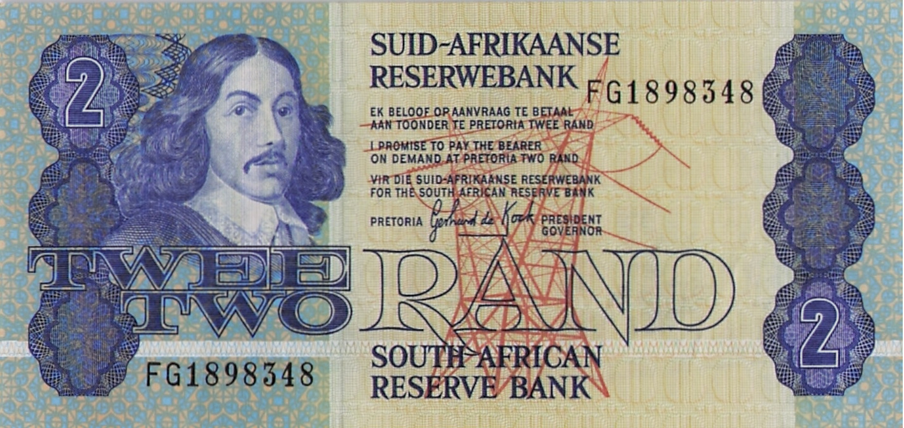
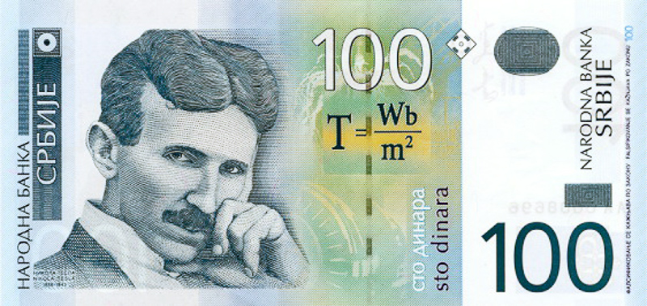
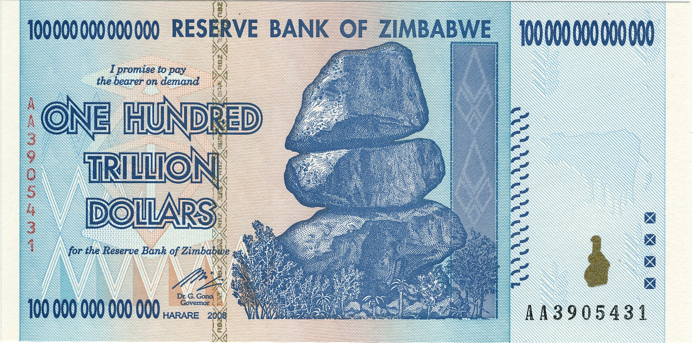
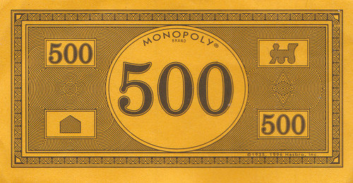

# <a href="https://en.wikipedia.org/wiki/The_Gods_Must_Be_Crazy">The Gods must be crazy</a>

Q: What do you call a collection of gods?  
    Pantheon is the particular set of all gods of any individual polytheistic religion, mythology, or tradition.  
A: Nope, a family.

# Generation W
* Connie #love
* Annemarie
* Susan
* Luna #moon
* Magda
* Maureen
* Ketaan #historian, *
* Andre
* Maureen's Sister
* Emme

These are the elder Gods, their time is precious, if someone want to document their life, their current payrate is pegged at you guessed it ZAR **42**k / hour.
DM me to facilitate an introduction.

# Generation X
* Lindie
* Louis #wisdom, #alcohol, #engineering, #madness, *
* Talitha #tranquility
* Chris #money, #alcohol, #logic, #food
* Elsie #serenity
* Linnea
* Landie
* Cindy

These Gods' stories are much more interesting and their payrate is even an order of magnitude cheaper, a mere ZAR 4,200.00 / hour.  (except Chris & Louis).

# Generation Y
* Kokkie
* Tiaan
* Janine
* Charlie

# Generation Z
**Non of your business**

# Generation &alpha;
**Non of your business**

  
Q: Do you worship the God of money?  
A: Then you owe him 10%. That is my brother Chris.  
    Make arrangements to settle your debt with him.  
    [https://scripturesavvy.com/bible-verses-about-paying-debt/](https://scripturesavvy.com/bible-verses-about-paying-debt/)

Since I beat Chris this time, I decree that the following notes (types) are now mine.
Is there such a thing as insider-trading in Forex trading? South Africa's new bank notes ;)

This note's value will be pegged to the latest USD value of a [Tesla S](./media/how_i_buy_a_car.jpg). 

If you want to buy a lot of Teslas.

These notes are used exclusively to finance larger Engineering projects.

The 500 note is used exclusively for children's pocket money. Since it is easier to [counterfeit](https://en.wikipedia.org/wiki/Counterfeit_money) businesses will have to apply [Know Your Client (KYC)](https://www.investopedia.com/terms/k/knowyourclient.asp) rules.

  
Oh yeah the <a href="http://louiscordier.com/the_3_book_of_louis/">proof</a> is in the pudding...

  

