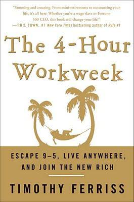

# Announcing APP
I am starting a new political party. The Afrikaner Political 
Party (APP).  It will be in a coalition with the <a href="https://en.wikipedia.org/wiki/Democratic_Party_(South_Africa)">Democratic Party (DA)</a>.

The current (dynamic) roles are:

| **Member** | **Roles** |
| ---- | ---- |
| Chris Cordier | president |
| Louis Cordier | minister of education, minister of energy |
| Elon Musk | minister of finance |

Elon this will be a remote, strictly a 4 hour work week kinda gig. We will do everything over video chat. It shouldn't take too much of your time.

# BRICS
[South Africa](https://en.wikipedia.org/wiki/South_Africa) is exiting BRICS (those countries don't have excellent engineering heritage).
Instead we are joining the "axis of evil", Germany and Japan. Sorry Italy, we are taking your place. ;p

> The term "axis of evil" is itself a portmanteau of the Axis powers of WWII (Nazi Germany, Fascist Italy, and Imperial Japan) and the Cold War era “Evil Empire” (the Soviet Union as described by Ronald Reagan).

## Capital
Since @elonmusk lost this round, the executive capital is moving back to Cape Town.
Suck it [Tuks](https://www.up.ac.za/) your pass rate is too high, [Maties](https://www.eng.sun.ac.za/) rule!

# For the kiddiez

Kiddies, I am bringing back <a href="https://www.statssa.gov.za/?p=16128">corporal punishment</a>.

<iframe width="560" height="315" src="https://www.youtube.com/embed/ppVpdsClN80?si=eg8c_Vij0AgAfl2T" title="YouTube video player" frameborder="0" allow="accelerometer; autoplay; clipboard-write; encrypted-media; gyroscope; picture-in-picture; web-share" allowfullscreen></iframe>

  

